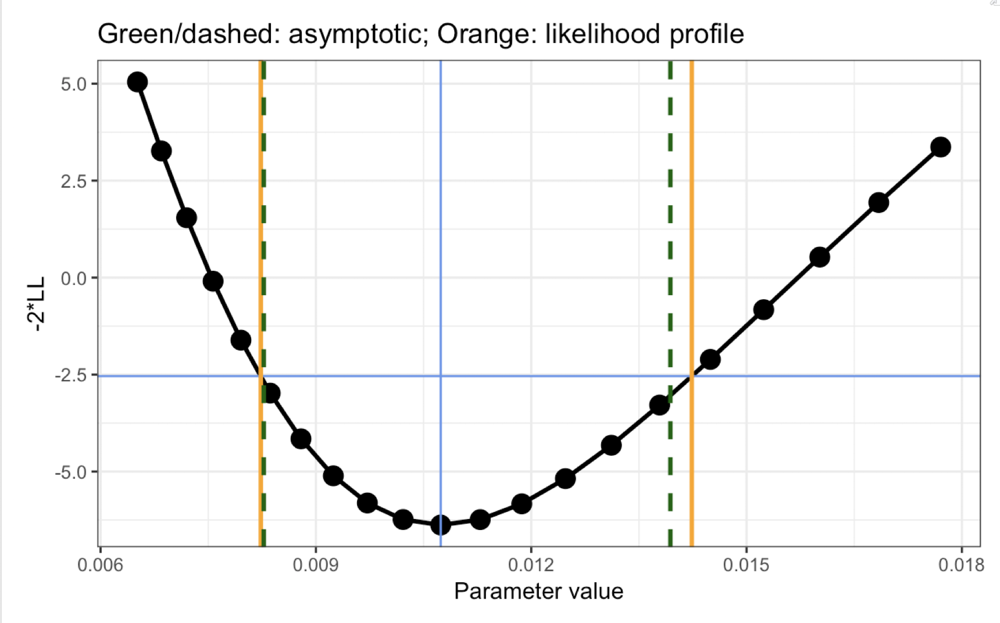

# Integrating the R Package mrgsolve With Available Optimization Routines for Parameter Estimation With PK, PK-PD and QSP Models

## Where / when

- University at Buffalo
  - 2019 CDSE Days (Buffalo, NY)
  - Wednesday, 10 April 2019 09:00 to 12:00

## Abstract

After a brief introduction to mrgsolve (https://mrgsolve.github.io), we will
discuss concepts and applications for using the package in R to estimate
parameters given a model and data.  We will establish a basic framework for
running optimization in R and work hands-on examples using different optimizers,
including local and global search algorithms. Building on this framework, we
will also illustrate related workflows including local sensitivity analysis and
likelihood profiling. Finally, a simulation-based workflow for generating
virtual populations (parameters) according to the method of Allen et al.
(https://doi.org/10.1002/psp4.12063) will be demonstrated.

</img>

## Vignettes

- Introduction slides
    - [0000_welcome.html](https://raw.githubusercontent.com/metrumresearchgroup/ub-cdse-2019/master/content/slides/0000_welcome.html) __right click on the link to download__
- Optimization introduction [tools_optimization_intro.md](content/tools_optimization_intro.md)
- Indomethacin PK [tools_optimization_indomethacin.md](content/tools_optimization_indomethacin.md)
- Optimizers [tools_optimization_methods.md](content/tools_optimization_methods.md)
- Likelihood profile - ddi model [tools_likelihood_profile.md](content/tools_profile_likelihood.md)
- Likelihood profile - indomethacin [tools_likelihood_profile_closed.md](content/tools_profile_likelihood_closed.md)
- Local sensitivity analysis [tools_sensitivity_local.md](content/tools_sensitivity_local.md)

