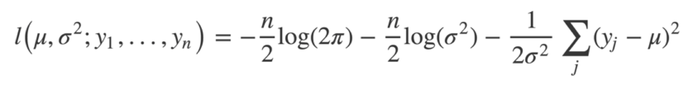
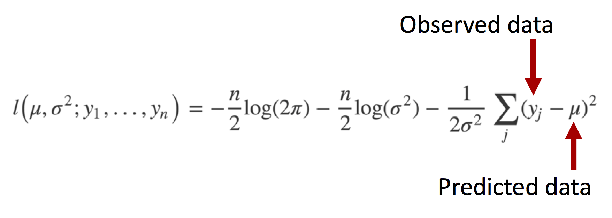
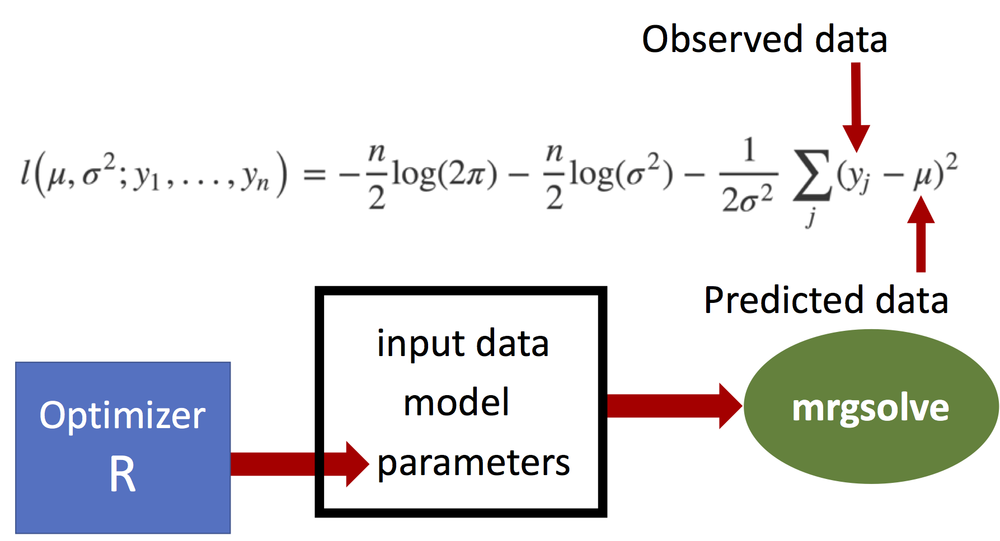
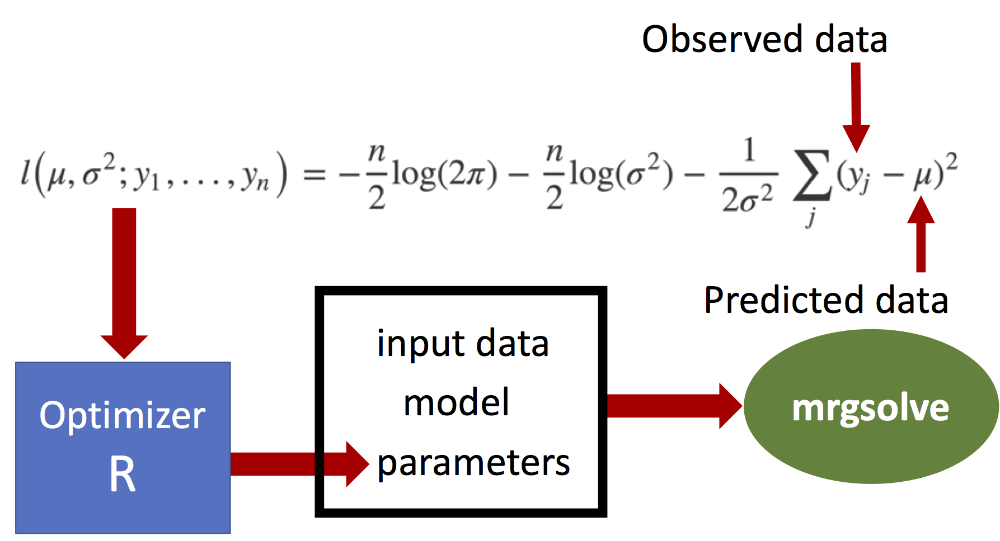

```{r, echo = FALSE, message = FALSE, warning = FALSE}
knitr::opts_chunk$set(message = FALSE)
options(mrgsolve.soloc = "build")
```


```{r, include = FALSE}
library(mrgsolve)
library(dplyr)
library(knitr)
library(lattice)

```

# Thanks for inviting us back!


__Case studies with mrgsolve: PBPK and QSP model implementation and utilization 
in  R __

https://github.com/metrumresearchgroup/pbpk-qsp-mrgsolve

CDSE Days 2018

# Optimization in R with mrgsolve

<hr>

https://github.com/metrumresearchgroup/ub-cdse-2019

<hr>

- mrgsolve intro
- The R "way" to do optimization (simple linear model)
- Indomethacin PK model optimization
- Pitavastatin / CsA DDI model optimization
- Look at options for different optimizers
- Local sensitivity analysis
- Likelihood profile
- Generate virtual population

# Optimization - likelihood function

</img>

# Optimization - likelihood function


</img>

# Optimization - likelihood function


</img>


# Optimization - likelihood function

</img>


# About `mrgsolve` 

- `R` package for simulation from ODE-based models
    - Free, OpenSource, GitHub, CRAN
- Language
    - Models written in `C++` inside model specification format
    - General purpose solver: `ODEPACK` / `DLSODA` (`FORTRAN`)
        - Automatically detect and switch between non-stiff (Adams) and stiff (BDF)
          methods for solving the differential equations
    - Simulation workflow in `R`
- Hierarchical (population) simulation
    - `ID`, $\eta$, $\varepsilon$
- Integrated PK functionaility
    - Bolus, infusion, `F`, `ALAG`, `SS` etc, handled under the hood
    - 1- and 2-cmt PK models in closed-form
- Extensible using `R`, `C++`, `Rcpp`, `boost`, `RcppArmadillo`
- `R` is it's natural habitat

# `mrgsolve` started as `QSP` modeling tool
- Motivation: large bone/mineral homeostatsis model (CaBone)
- History using
    - Berkeley Madonna
    - WinBUGS
    - NONMEM (attempted)
- 2010: write `R` front end to `deSolve`
- 2012: write `C++` interface to `DLSODA`
- Develop dosing / event capability
- More recently, expose functionality provided by
    - `Rcpp` - vectors, matrices, functions, environments, random numbers 
    - `boost` - numerical tools in `C++`
    - users' own `C++` code (functions, data structures, classes)
- Translator from `SBML` to `mrgsolve` using `R` bindings to `libSBML`   


# Orientation

- https://CRAN.R-project.org/package=mrgsolve

- GitHub site: https://github.com/metrumresearchgroup/mrgsolve

- Issues and questions: https://github.com/metrumresearchgroup/mrgsolve/issues

- mrgsolve website: https://mrgsolve.github.io

- User Guide: https://mrgsolve.github.io/user_guide

- Blog: https://mrgsolve.github.io/blog

- Vignettes: https://mrgsolve.github.io/vignettes


# Wonderful options for optimization in R

CRAN Task View: https://cran.r-project.org/web/views/Optimization.html


