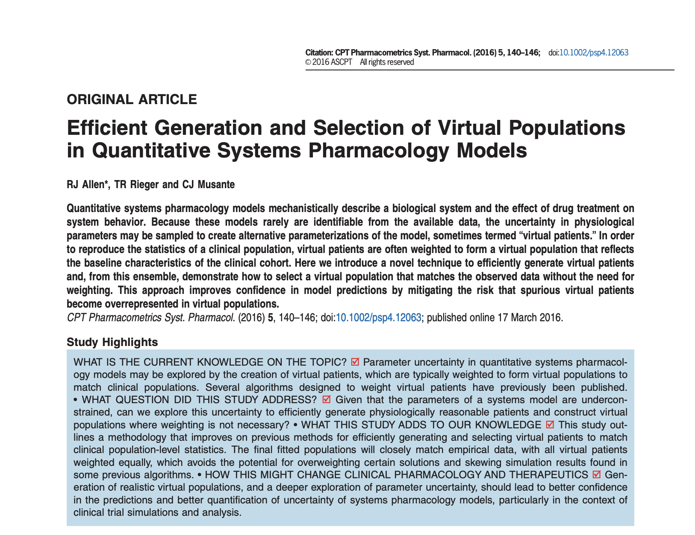
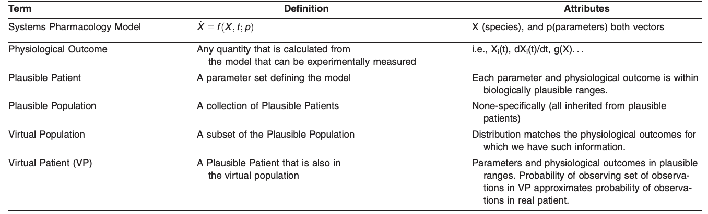
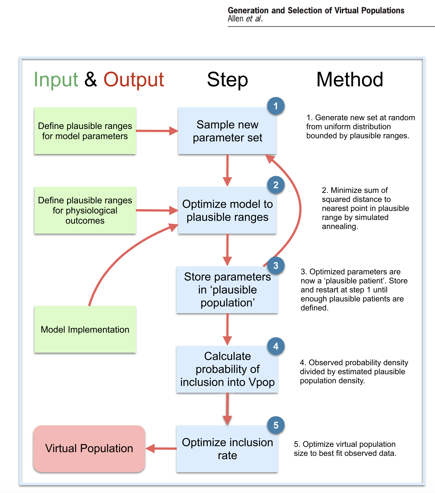
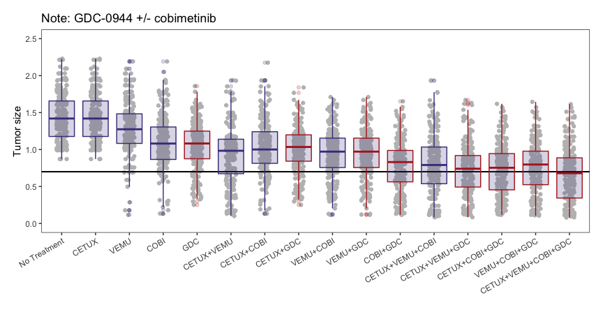
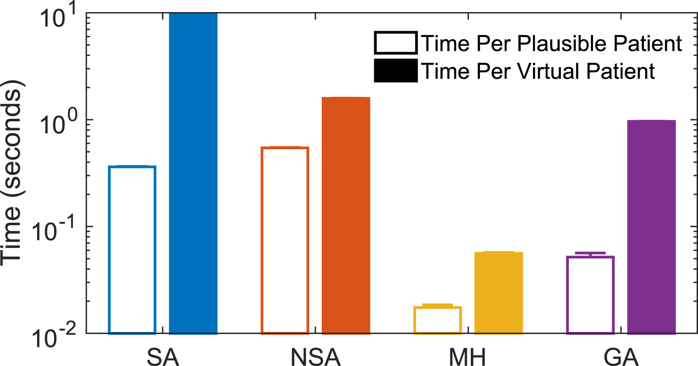

```{r, echo = FALSE, message = FALSE, warning = FALSE}
knitr::opts_chunk$set(message = FALSE)
options(mrgsolve.soloc = "build")
```


```{r, include = FALSE}
library(mrgsolve)
library(dplyr)
library(knitr)
library(lattice)
library(magrittr)
library(tidyr)
library(ggplot2)
```


# Introduction 

```{r echo=FALSE, fig.cap="<small>Allen, R.J., Rieger, T.R., & Musante, C.J. (2016). Efficient Generation and Selection of Virtual Populations in Quantitative Systems Pharmacology Models. CPT: pharmacometrics & systems pharmacology, 5 3, 140-6.</small>",fig.align='center'}

```

# Definitions

```{r echo=FALSE, fig.cap="Definitions of plausible and virtual patients and populations",fig.align='center',out.width="100%"}

```


# Workflow

```{r fig2, echo=FALSE, out.width = '65%',fig.align='center'}

```

# Overview of MAPK Virtual Population

* Try to re-create oberved (simulated) distribution of tumor sizes for GDC treatment
    * start with mapk model 
    * only data is tumor size at 56 days
```{r echo=FALSE, fig.align='center',out.width='100%'}

```

# Plausible Patients

 * Parameters which are to be varied in the model are identified and physiologic limits on the bounds of these parameters are established based:
    * intiution 
    * data
    * experience
    
* In the mapk model the following 27 parameters are considered:
```{r echo=FALSE}

# Load simulation results (We are trying to match this Population)
sims <- readRDS("../mapk/mapk_sims.RDS")
sims %<>% filter(label == "GDC")

# Load treatment regimens
reg <- readRDS("../mapk/mapk_setup.RDS")
reg %<>% filter(label == "GDC")%>%pull(object)
reg <- reg[[1]]

model <- mread("mapk", '../mapk/', soloc = '../mapk')
m_params <- names(param(model))

# What parameters do we need to explore?
foo <- readRDS("../mapk/s10vpop_pk.RDS")
# (foo %>% summarise_all(sd)%>%gather()%>%filter(value!=0))%>%pull(key)
# length((foo %>% summarise_all(sd)%>%gather()%>%filter(value!=0))%>%pull(key))
p_names <- foo %>% summarise_all(sd)%>%gather()%>%filter(value!=0)
# 33 of them
ICs <- foo %>% summarise_all(sd)%>%gather()%>%filter(value==0)
ICnames <- ICs$key
ICs <- foo%>%summarise_all(mean)%>%gather()%>%filter(key %in% ICnames)
ICs %<>% spread(key,value)

# Filter only to ones present in model
p_names %<>% filter(key %in% m_params)%>%pull(key)
print(p_names)
```

# Plausible Patients

* Parameter limits set at 50% smaller than the minimum and 50% greater than the maximum values from the reported virtual population
    * Often have to do this based on physiology, prior knowledge
* Initially, no limits on upper bound of tumor size, lower limit = 0.
    * Can set limits at multiple time point (i.e constrained trajectories)

# Plausible Patients
```{r}
params <- readRDS("../mapk/s10vpop_pk.RDS")
pLower <- params %>% summarise_all(.funs = function(x){min(x)*0.5})
pUpper <- params %>% summarise_all(.funs = function(x){max(x)*1.5})
pLower %<>% gather(key="Name",value="Lower")
pUpper %<>% gather(key="Name",value="Upper")
paramLims <- left_join(pLower,pUpper,by="Name")
paramLims %<>% filter(Name %in% p_names)
kable(paramLims)
```


# Plausible Patients
```{r}
stateLims <- data.frame(Name = 'TUMOR','Lower'=0,'Upper'=Inf,Time=56)
kable(stateLims)
```

# Plausible Patient Generation
A set of initial random parameters is used as the initial guess for a simulated annealing (SA) optimization algorithm

> - Typically:
>  $$f(p) = \sum_{i=1...m}(M_i(p) - d_i)^2$$

> - Want to converge to plausible region, $L$, as defined by the output constraints:
> $$L = X_1 \times ... \times X_m$$
> <center>where $X_i=[l_i,u_i]$ are the lower and upper bounds, respectively for ouput $i$. </center>

> - new objective function, $g(p)$, flat-bottomed quadratic: 
> $$g(p) = \sum_{i=1...m}max((M_i(p) - c_i)^2-(u_i-c_i)^2,0)$$
> <center>where $c_i=\frac{l_i+u_i}{2}$. The result of this is $g(p) = 0$ if $M(p) \in L$. </center>

> - SA algorithm stops when OFV = 0 (or some threshold)
>      * parameter set that meets all parameter and state constraints has been found
>     * repeated many times with different initial parameter guesses
>         * stochastic nature of SA algorithm leads to unique and independent plausible patient population

# Simulation Function
```{r}
model <- mread("mapk", '../mapk/', soloc = '../mapk')
sim_fcn <- function(parameters=NULL,model,pnames,dosing,ICs,simulate=0){
  loadso(model) # Load model
  # Case with parameters defined by plausible patient algorithm
  if(!is.null(parameters)){
    param_in <- data.frame(Names = pnames,Values=parameters)
    param_in <- spread(param_in,key=Names,value=Values)
  # Create case for testing with default parameters
  }else{
    param_in <- data.frame(ID=1)
  }
  # Bind parameters with initial conditions
  param_in %<>% cbind(ICs)
  # Simulate and extract tumor size at dat 56
  output <- model%>%idata_set(param_in) %>%Req(TUMOR)%>%
    obsonly%>%mrgsim(delta=56,end=56,events=as.ev(dosing))%>%
    filter(time==56)%>%as.data.frame()
  # For VP generation, return a list of steady state and non-steady state outputs
  if(simulate==0){
    return(list(NSS=output))
  # Otherwise return the dataset
  }else{
    return(output)
  }
}
```

# Generate Plausible Patients
```{r,eval=FALSE}
control=list(runParallel="parallel",nCores = 4,
                       parallel_libs="mrgsolve") # Setup parallel run
plausiblePatients <- generatePPs(model_fn = sim_fcn, NP=1e3, paramLims=paramLims,stateLims = stateLims,
                                 method='SA',
                                 model_args = model_args,
                                 scoreThreshold = 0)
```
```{r,echo=FALSE,fig.align='center',out.width='75%'}
plausiblePatients <- readRDS("../mapk/plausibleUnbounded.RDS")
VPs <- readRDS("../mapk/VPUnbounded.RDS")
sims <- readRDS("../mapk/mapk_sims.RDS")
sims %<>% filter(label == "GDC")
hist_data <- plausiblePatients$simulation_results%>%mutate(Source="Plausible")
hist_data %<>% rbind(sims%>%select(ID,time,TUMOR)%>%mutate(Source='"Observed"'))

ggplot(hist_data,aes(x=TUMOR))+geom_density(aes(x=TUMOR,y=..scaled..,fill=Source),alpha=0.5)
```

# Virtual Population

* Unlikely that plausible population distribution(s) will match data
    * need to decide which plausible patients to include in virtual population -> resampling

> - Consider the selection function $S:V_{pl} \rightarrow \{0,1\}$ as:
> $$
> S(p_j) = \begin{cases}
> 1, \text{ if } p_j \in V_{pop}\\
> 0, \text{ if otherwise}
> \end{cases}
>$$
> - From Bayes' thereom we have:
> $$
> P\left(S(p_j) = 1 | M(p_j)\in R\right) = \frac{\left(M(p_j)\in R|S(p_j) = 1\right)P\left( S(p_j)=1\right)}{P\left( M(p_j)\in R\right)}
> $$
> <center> this gives the probability of a plausible patient $p_j$, given that $M(p_j)$ (the simulated outcomes) is in the region $R$ and is also a **virtual patient**.</center>

> - If $p_j$ is in the virtual population then the probability of $M(p_j)$ being in the same region $R$ should be approximately equal to the probability of observing the clinical or empirical data in the region $R$. 
>     * if $d \in D$, Bayes' rule from above can be re-written as:
>$$
>P\left(S(p_j) = 1|M(p_j)\in R\right) \approx \frac{P(d\in R)P\left(S(p_j)=1\right)}{P\left(M(p_j)\in R\right)}
>$$

# Virtual Population

<center> $P\left(S(p_j)=1\right)$ is unknown </center>

> - For a fixed plausible population $P\left(S(p_j)=1\right)$ should be a constant

> - Reformulate Bayes' Rule again: 
>$$
>P\left(S(p_j)=1|M(p_j)\in R\right) \approx \alpha\frac{P(d\in R)}{P\left(M(p_j)\in R\right)}
>$$

> - Need to compute $P(d\in R)$ and $P\left(M(p_j) \in R\right)$
>      * Use kernel density estimate (KDE)
>           * univariate for mapk problem, can be multivariate (warning: computationally expensive)

> - $\alpha$ ~ size of the virtual population (or the inclusion rate into the virtual population)
>      * Here $\alpha$ will be optimized using particle swarm optimization (PSO) for speed and robustness
>      * a vector of random numbers $r_1,r_2...r_i...r_N$ is generated from the uniform distribution and if $r_i < \alpha\frac{P(d\in R)}{P\left(M(p_j)\in R\right)}$  $p_i$ is selected as a possible member of the virtual population
>      * "Score" or OFV: two-sample Kolmogorov-Smirnov Test statistics between  $p_{select}$ and the empirical distribution for each measured outcome in the data (not strictly applicable for multivariate problems)
>      *  find $\alpha$ to minimize OFV

> -  **Note:** for robustness, rejection-sampling is repeated between 10 and 50 times for each value of $\alpha$ and the final objective function value is taken as the average of the summed KS scores over all trials.

> - Final VP generated by resampling with optimal $\alpha$

# Virtual Population (Results)

```{r, echo=FALSE,fig.align="center",out.width="85%"}
plausiblePatients <- readRDS("../mapk/plausibleUnbounded.RDS")
VPs <- readRDS("../mapk/VPUnbounded.RDS")
hist_data <- plausiblePatients$simulation_results%>%mutate(Source="Plausible")
hist_data %<>% rbind(sims%>%select(ID,time,TUMOR)%>%mutate(Source='"Observed"'))
hist_data %<>% rbind((VPs$VPs)%>%mutate(Source="VP"))
unique <- hist_data%>%group_by(Source)%>%count(Source)
hist_data <- merge(hist_data,y = unique, by='Source',all.x=TRUE)
ggplot(hist_data) + geom_density(aes(x=TUMOR,y=..scaled..,fill=Source),alpha=0.5)

```

# Virtual Population Efficiency

Yield: $N_{VP}/N_{PP}$ = 21.8%

> - How can we increase VPop efficiency?
>        * More closely approximate final distribution with plausible patients -> better bounds

```{r}
stateLims <- data.frame(Name = 'TUMOR','Lower'=0,'Upper'=2.5,Time=56)
kable(stateLims)
```

# Virtual Population Efficiency

```{r,echo=FALSE,fig.align='center',out.width='75%'}
plausiblePatients <- readRDS("../mapk/plausibleBounded.RDS")
VPs <- readRDS("../mapk/VPBounded.RDS")
sims <- readRDS("../mapk/mapk_sims.RDS")
sims %<>% filter(label == "GDC")
hist_data <- plausiblePatients$simulation_results%>%mutate(Source="Plausible")
hist_data %<>% rbind(sims%>%select(ID,time,TUMOR)%>%mutate(Source='"Observed"'))
ggplot(hist_data,aes(x=TUMOR))+geom_density(aes(x=TUMOR,y=..scaled..,fill=Source),alpha=0.5)
```

# Virtual Population Effiency
Yield = 25.5%
```{r, echo=FALSE,fig.align="center",out.width="85%"}
plausiblePatients <- readRDS("../mapk/plausibleBounded.RDS")
VPs <- readRDS("../mapk/VPBounded.RDS")
hist_data <- plausiblePatients$simulation_results%>%mutate(Source="Plausible")
hist_data %<>% rbind(sims%>%select(ID,time,TUMOR)%>%mutate(Source='"Observed"'))
hist_data %<>% rbind((VPs$VPs)%>%mutate(Source="VP"))
unique <- hist_data%>%group_by(Source)%>%count(Source)
hist_data <- merge(hist_data,y = unique, by='Source',all.x=TRUE)
ggplot(hist_data) + geom_density(aes(x=TUMOR,y=..scaled..,fill=Source),alpha=0.5)
```

# Further Improvements

See *Rieger TR, Allen RJ, Bystricky L, Chen Y, Colopy GW, Cui Y, Gonzalez A, Liu Y, White RD, Everett RA, Banks HT, Musante CJ: Improving the generation and selection of virtual populations in quantitative systems pharmacology models. Prog Biophys Mol Biol 139:15–22, 2018*

* Alternative optimization algorithms for plausible patient generation
    * nested simulated annealing: augments the SA method by targeting PP generation using the probability density function of the target distribution
    * genetic algorithm: iteratively builds a plausible population according to a fitness function defined by the desired distribution
    * Metropolis-Hastings: importance samping
    
# Further Improvements and Performance

```{r echo=FALSE, fig.align="center",out.width="49%",out.height="20%",fig.show='hold'}
  knitr::include_graphics(c("../images/goodness_offit.jpg","../images/gof2.jpg"))
```
    
```{r echo=FALSE, fig.align="center",out.width="49%"}
  
```        


