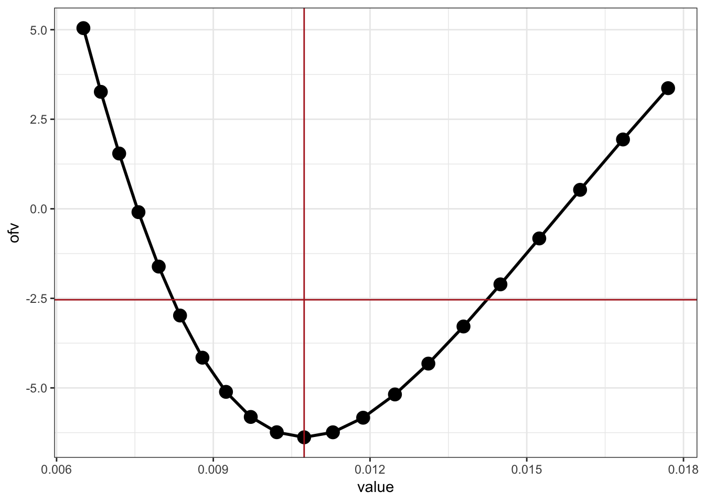
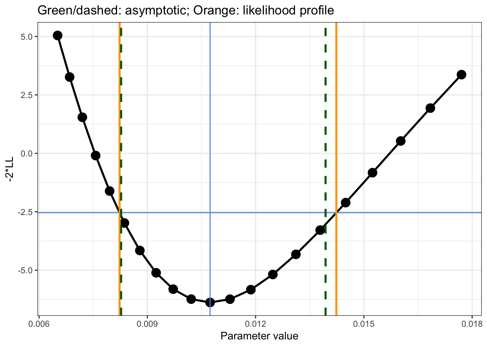

Likelihood Profile to Generate Standard Error
================
Metrum Research Group

  - [First, we fit the model by normal likelihood
    estimation](#first-we-fit-the-model-by-normal-likelihood-estimation)
  - [Generate CI by Hessian for
    Comparison](#generate-ci-by-hessian-for-comparison)
  - [Generate CI by likelihood
    profile](#generate-ci-by-likelihood-profile)
  - [Compare values from likelihood profile and
    hessian](#compare-values-from-likelihood-profile-and-hessian)

``` r
library(tidyverse)
library(mrgsolve)
library(nloptr)
options(mrgsolve.soloc = "build")
```

</img>

# First, we fit the model by normal likelihood estimation

**DATA**

``` r
mod <- mread_cache("model/yoshikado.cpp", end = 12, delta = 0.5)
data <- read_csv("data/fig4a.csv") 
data <- mutate(data, DV = ifelse(DV < 0, NA_real_, DV), profile = NULL)
```

**OBJECTIVE FUNCTION**

``` r
fun <- function(p,data,mod,name) {
  names(p) <- name
  p <- lapply(p,exp)
  mod <- param(mod, p)
  out <- mrgsim_d(mod,data,output="df")
  like <- dnorm(log(data[["DV"]]),log(out[["CP"]]),sd = p$sigma,log=TRUE)
  -sum(like, na.rm=TRUE)
}
```

**FIT**

``` r
theta <- c(
  fbCLintall = 1.2, 
  ikiu = 1.2, 
  fbile = 0.9, 
  ka = 0.1, 
  ktr = 0.1,
  sigma = 1
) %>% log()

fun(theta,data,mod,names(theta))
```

    . [1] 62.89353

``` r
fit <- newuoa(x0 = theta, fn = fun, data = data, mod = mod, name=names(theta))

exp(fit$par) %>% set_names(names(theta))
```

    . fbCLintall       ikiu      fbile         ka        ktr      sigma 
    . 0.79165805 0.01073883 0.35424754 1.19931498 0.72675505 0.20629538

# Generate CI by Hessian for Comparison

Get a 95% CI using hessian by finite difference

``` r
parn <- 2

mod2 <- update(mod, rtol = 1E-14, atol = 1e-14)

h <- nlme::fdHess(fit$par, fun = fun, data = data, mod = mod2, name = names(theta))

se <- h$Hessian %>% solve %>% diag %>% sqrt 

ci <- fit$par[parn] + 1.96*se[parn]*c(-1,1)

names(ci) <- c("lb", "ub")

exp(ci) %>% signif(3)
```

    .      lb      ub 
    . 0.00827 0.01390

Same answer with
`numDeriv`

``` r
h2 <- numDeriv::hessian(fun, fit$par, data = data, mod = mod2, name = names(theta))
se2 <- h2 %>% solve %>% diag %>% sqrt
ci2 <- fit$par[parn] + 1.96*se2[parn]*c(-1,1) %>% set_names(c("lb", "ub"))
exp(ci2) %>% signif(3)
```

    .      lb      ub 
    . 0.00828 0.01390

# Generate CI by likelihood profile

First, let’s take the estimates from the maximum likelihood estimation
as the new set of initial estimates.

But we want to remove `ikiu`

``` r
th <- fit$par
names(th) <- names(theta)
th <- th[names(th) != "ikiu"]
```

Pick a bunch of values for `ikiu` for evaluating the likelihood

``` r
ikiu <- exp(fit$par[parn] + seq(-0.5,0.5,0.05))
```

Function to re-fit the model; we keep the value of `ikiu` as well as
`-2*LL`

``` r
llprof <- function(value, fix = list(ikiu = mod$ikiu)) {
  fix[[1]] <- value
  mod <- update(mod, param = fix)
  fit <- newuoa(x0 = th, fn = fun, data = data, mod = mod, name= names(th))
  tibble(par = names(fix)[1], value = value, ofv = 2*fit$value)
}
```

Fit models for likelihood profile

``` r
df <- parallel::mclapply(ikiu, llprof) %>% bind_rows()
```

We want to find the values of `ikiu` where `-2*LL` from the original fit
increases by 3.84

``` r
target <- 3.84 + 2*fit$value

ggplot(df, aes(value,ofv)) + geom_line(lwd=1) + geom_point(size=4) + 
  geom_hline(yintercept = target, col="firebrick") + 
  geom_vline(xintercept=exp(fit$par[parn]),col="firebrick") 
```



We can get the exact value for `ikiu` by linear interpolation. First the
lower bound

``` r
lo <- filter(df, value < mod$ikiu)
lb <- approx(lo[["ofv"]], lo[["value"]], target)$y
```

Now the upper bound

``` r
hi <- filter(df, value > mod$ikiu)
ub <- approx(hi[["ofv"]], hi[["value"]], target)$y
```

Compare against the result using the Hessian

``` r
list(hess = exp(ci), profile = c(lower = lb, uppper = ub))
```

    . $hess
    .          lb          ub 
    . 0.008273548 0.013938708 
    . 
    . $profile
    .       lower      uppper 
    . 0.008232169 0.014237283

# Compare values from likelihood profile and hessian

``` r
ggplot(df, aes(value,ofv)) + geom_line(lwd=1) + geom_point(size=4) + 
  geom_hline(yintercept = target, col="firebrick") + 
  geom_vline(xintercept = exp(fit$par[parn]),col="firebrick") + 
  geom_vline(xintercept = c(lb,ub),col="orange",lwd=1) +
  geom_vline(xintercept = exp(ci),col="darkgreen",lwd=1,lty=2) +
  ggtitle("Green/Grey: hessian; Orange: likelihood profile")
```


