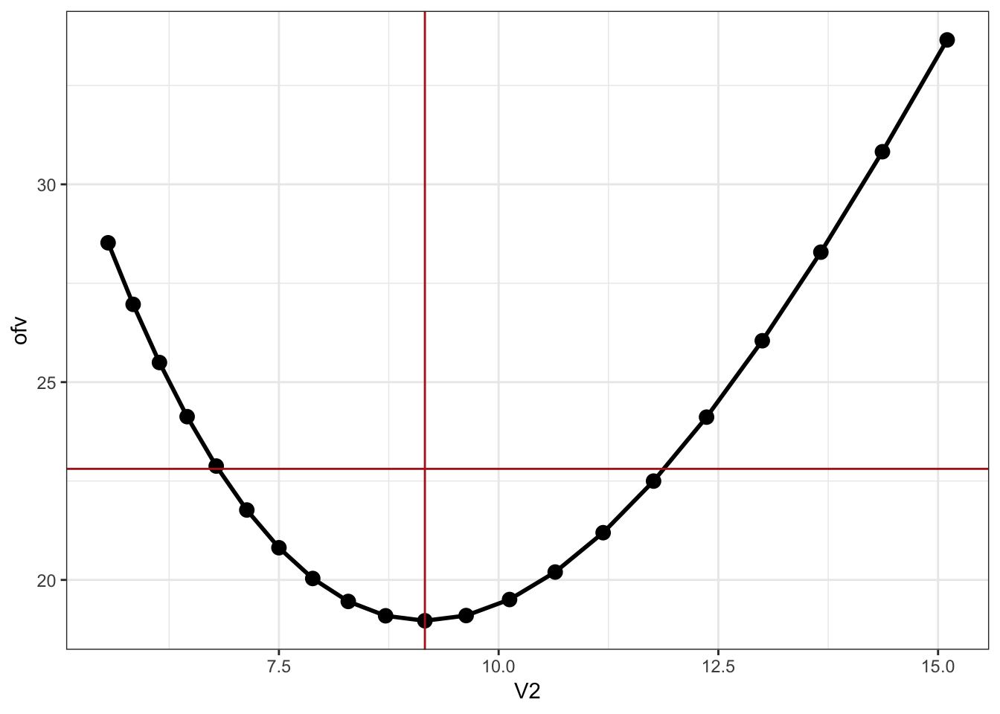
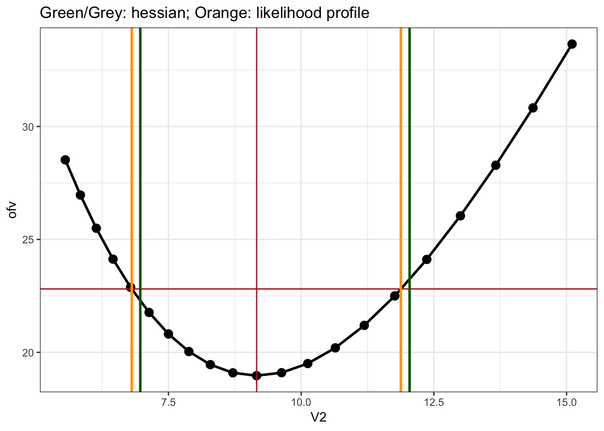

Likelihood Profile to Generate Standard Error (2)
================
Metrum Research Group

  - [First, we fit the model by normal likelihood
    estimation](#first-we-fit-the-model-by-normal-likelihood-estimation)
  - [Generate CI by Hessian for
    Comparison](#generate-ci-by-hessian-for-comparison)
  - [Generate CI by likelihood
    profile](#generate-ci-by-likelihood-profile)
  - [Compare LL profile with asymptotic
    CI](#compare-ll-profile-with-asymptotic-ci)
  - [Check the result with `nls`](#check-the-result-with-nls)

``` r
library(tidyverse)
library(mrgsolve)
library(nloptr)
options(mrgsolve.soloc = "build")
```

# First, we fit the model by normal likelihood estimation

**DATA**

``` r
mod <- modlib("pk2")
data <- read_csv("data/indometh.csv", na='.') 
```

**OBJECTIVE FUNCTION**

``` r
fun <- function(p,data,mod,name) {
  names(p) <- name
  p <- lapply(p,exp)
  mod <- param(mod, p)
  out <- mrgsim_d(mod,data,output="df")
  like <- dnorm(log(data[["conc"]]), log(out[["CP"]]), p$sigma, log=TRUE)
  -sum(like, na.rm=TRUE)
}
```

**FIT**

``` r
theta <- c(
  CL = 1, 
  V2 = 1, 
  Q = 1, 
  V3 = 1,
  sigma=1
) %>% log()

fun(theta,data,mod,names(theta))
```

    . [1] 219.227

``` r
fit <- newuoa(x0 = theta, fn = fun, data = data, mod = mod, name=names(theta))

fit$par
```

    . [1]  2.110199  2.214933  1.717099  2.809875 -1.275243

# Generate CI by Hessian for Comparison

Get a 95% CI using Hessian by finite difference

``` r
parn <- 2

h <- nlme::fdHess(fit$par, fun = fun, data = data, mod = mod, name = names(theta))

se <- h$Hessian %>% solve %>% diag %>% sqrt 

ci <- fit$par[parn] + 1.96*se[parn]*c(-1,1)

names(ci) <- c("lb", "ub")

exp(ci)
```

    .        lb        ub 
    .  6.968671 12.042504

Same answer with
`numDeriv`

``` r
h2 <- numDeriv::hessian(fun, fit$par, data = data, mod = mod, name = names(theta))
se2 <- h2 %>% solve %>% diag %>% sqrt
ci2 <- fit$par[parn] + 1.96*se2[parn]*c(-1,1)
exp(ci2)
```

    . [1]  6.968692 12.042469

# Generate CI by likelihood profile

Just work on `V2` for now.

First, let’s take the estimates from the maximum likelihood estimation
as the new set of initial estimates. But we want to remove `V2` from the
list.

``` r
th <- fit$par
names(th) <- names(theta)
th <- th[names(th) != "V2"]

th
```

    .        CL         Q        V3     sigma 
    .  2.110199  1.717099  2.809875 -1.275243

Pick a bunch of values for `V2` for evaluating the likelihood

``` r
v2 <- exp(fit$par[parn] + seq(-0.5,0.5,0.05))

llprof <- function(value, fix = list(V2 = fit$par[parn])) {
  fix[[1]] <- value
  mod <- update(mod, param = fix)
  fit <- newuoa(x0 = th, fn = fun, data = data, mod = mod, name= names(th))
  tibble(par = names(fix)[1], value = value, ofv = 2*fit$value)
}
```

Now, re-fit the model after fixing `V2` to the candidate value

``` r
df <- parallel::mclapply(v2, llprof) %>% bind_rows()
```

We want to find the value of `V2` where -2\*LL increases by 3.84

``` r
target <- 3.84 + 2*fit$value

ggplot(df, aes(value,ofv)) + geom_line(lwd=1) + geom_point(size=3) + 
  geom_hline(yintercept = target, col="firebrick") + 
  geom_vline(xintercept=exp(fit$par[parn]),col="firebrick") + xlab("V2")
```



Use linear interpolation to find the point of intersection. First go
after the lower gound

``` r
lo <- filter(df, value < exp(fit$par[parn]))
lb <- approx(lo[["ofv"]], lo[["value"]], target)$y
lb
```

    . [1] 6.808692

Then get the upper bound

``` r
hi <- filter(df, value > exp(fit$par[parn]))
ub <- approx(hi[["ofv"]], hi[["value"]], target)$y
ub
```

    . [1] 11.87822

``` r
list(hess = exp(ci), profile = c(lower = lb, uppper = ub))
```

    . $hess
    .        lb        ub 
    .  6.968671 12.042504 
    . 
    . $profile
    .     lower    uppper 
    .  6.808692 11.878221

# Compare LL profile with asymptotic CI

``` r
ggplot(df, aes(value,ofv)) + geom_line(lwd=1) + geom_point(size=3) + 
  geom_hline(yintercept = target, col="firebrick") + 
  geom_vline(xintercept = exp(fit$par[parn]),col="firebrick") + 
  geom_vline(xintercept = exp(ci),col="darkgreen",lwd=1) +
  geom_vline(xintercept = c(lb,ub),col="orange",lwd=1) +
  ggtitle("Green/Grey: hessian; Orange: likelihood profile") + xlab("V2")
```



# Check the result with `nls`

``` r
fun <- function(CL,V2,Q,V3) {
  p <- list(CL = CL, V2 = V2, Q = Q, V3 = V3)
  p <- lapply(p,exp)
  mod <- param(mod, p)
  out <- mrgsim_d(mod,data,output="df",obsonly=TRUE)
  log(out[["CP"]])
}

theta <- c(
  CL = 1.1, 
  V2 = 1.1, 
  Q = 1.1, 
  V3 = 1.1
) %>% log()

data <- mutate(data, lconc = log(conc))

ff <- nls(lconc~fun(CL,V2,Q,V3) , data=data, start=as.list(theta), na.action=na.omit)
          
broom::tidy(ff) %>% pull(std.error)
```

    . [1] 0.04800908 0.13300206 0.11161948 0.20228813

``` r
se
```

    . [1] 0.04668884 0.13954537 0.11309971 0.20570321 0.08703888
